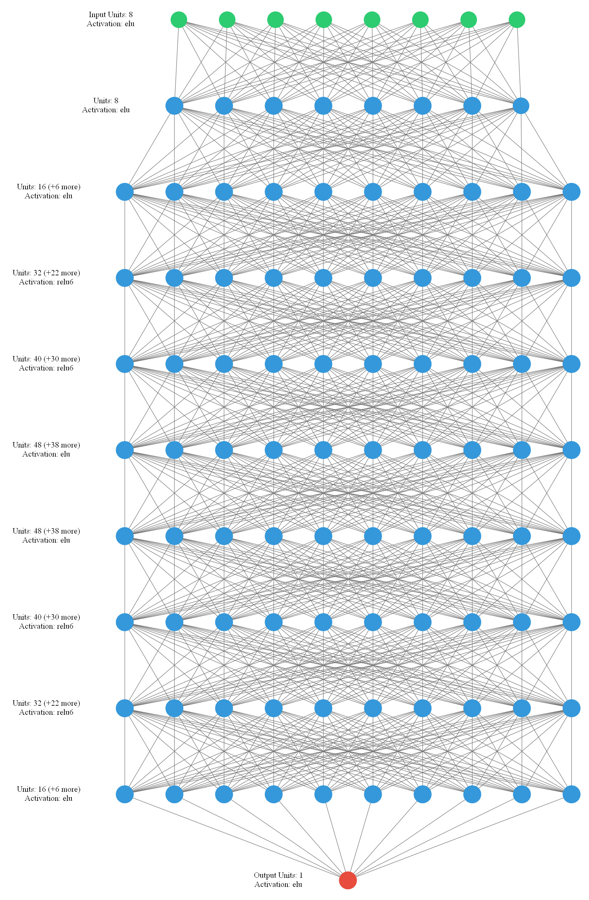

# Concrete Compressive Strength DNN


This is Repository for the purpose for an academic research project for IME at NUST
with AI using Tensorflow.

Please Take Note the Project was compiled by: DeveloperPrince (Prince Kudzai Maposa N01416165H) for practice purposes

You can utilize the solutions to improve your understanding in AI using TensorFlow

## Note

The Solutions are not production ready, if you want to make production ready model please take note of the tensorflow documentation or contact DeveloperPrince

## Guide

The repository contains two regression based problems one is complete with a saved machine learning model ready for production use and the other is still a work in progress

## Directory Structure

### Overview

# CCST_ML


>Concrete compressive strength is determined by mixing different compositions of 7 elements which are namely:

Cement (component 1)
Blast Furnace Slag (component 2)
Fly Ash (component 3) -- quantitative
Water (component 4) -- quantitative
Superplasticizer (component 5) -- quantitative
Coarse Aggregate (component 6) -- quantitative
Fine Aggregate (component 7) -- quantitative

These elements are then allowed to sit for a given time period which will be denoted as:

Age -- quantitative -- Day (1~365) -- Input Variable

For which a load is then applied to dry concrete until it raptures or breaks. The maximum Load the concrete can bear before it breaks is known as the compress strength of the concrete.

in order to make use and test the model run

Recommended model is a 9 layer Diamond model:



## Requirements

1. python 3.6
2. graphviz (ensure this set up to be accessed globally on your machine)

## Setup

1. Create virtual environment

```bash
python3 -m venv dev
```

or

```bash
python -m venv dev
```

2. Activate virtual environment

if using windows OS for development use the following

```bash
dev\Scripts\activate
```


3. Install dependencies

```bash
pip install -r requirements.txt
```

4. Run Model

## Commands
```bash
python concrete_comp_test_model.py
```
This command will input csv file containing 8 features and labels of data, which will be broken down into testing and training data with a ratio of 2:8

Then it should take in test data as its input then output predictions for the corresponding features.

In order to have you own custom input of data run the following

```bash
python concrete_comp_run_cli.py compile arg1 arg2 arg3 arg4 arg5 arg6 arg7 arg8
```

where the arguments are as follows:

arg1 = Cement quantity
arg2 = Blast Furnace Slag quantity
arg3 = Fly Ash quantity
arg4 = Water quantity
arg5 = Superplasticizer quantity
arg6 = Coarse Aggregate quantity
arg7 = Fine Aggregate quantity
arg8 = Age

From the listed arguments you should get you concrete compressive strength as a json object

Here is an example:

```bash
python concrete_comp_run_cli.py compile 2 5 0 0 45 67 8 85
```

the results:
```bash
{"ccst": 577.537109375}
```

### Errors

If you place more than the required numbers of arguments it will return a json object of error = 1

```bash
{"error": 1}
```

If you place less than the required numbers of arguments it will return a json object of error = 0

```bash
{"error": 0}
```

Make sure the command for compiling and running the model is compile anything outside this will pass a json object of error = 5

```bash
{"error": 5}
```

Make sure the command for compiling and running the model is compile anything outside this will pass a json object of error = 4, this type of error is a runtime error

```bash
{"error": 4}
```

#### Contact

Please take note of the following contact details for further assistance


>Cellphone/Mobile Number: +263786808538/+263714272770
>Email address: princekudzaimaposa94@gmail.com


